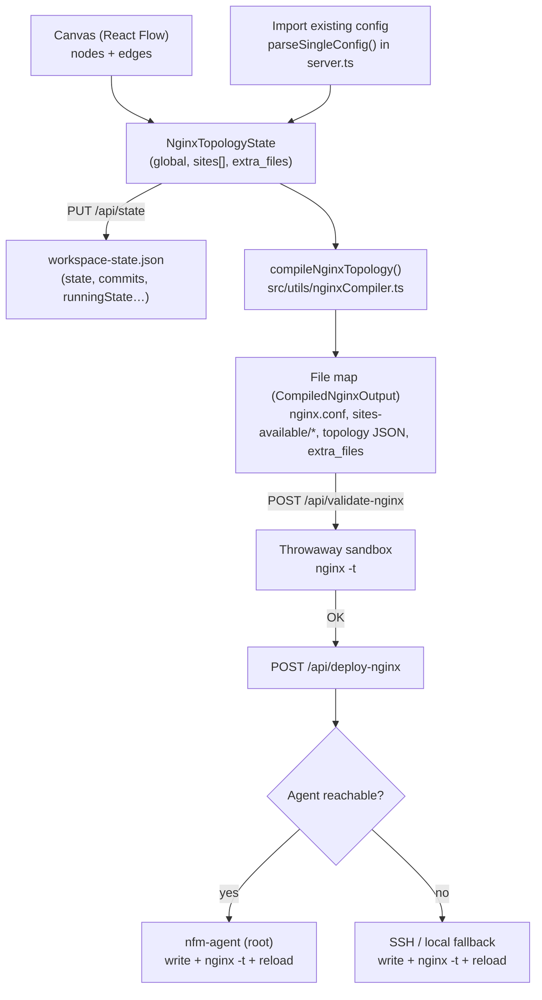

# Architecture

> System design of Nginx Flow Manager: how a visual topology on the canvas becomes validated, deployed nginx configuration — and how an existing config is imported back into that topology.

This document covers the topology data model, the pure‑TypeScript compiler, the import parser, persistence, and the deploy path. For end‑user workflows see [USAGE.md](USAGE.md); for the on‑server agent see [AGENT.md](AGENT.md); for the HTTP surface see [API.md](API.md); for the security model see [SECURITY.md](SECURITY.md).

---

## 1. High‑level data flow

Nginx Flow Manager is a closed loop: you draw a topology, it compiles to real nginx files, those files are validated in a throwaway sandbox, and only then deployed and reloaded on the remote host. An existing config can be imported, turning text back into a topology — and the import↔compile round‑trip is designed to be verbatim‑faithful.



Textual summary of the forward path:

1. **Canvas → state.** The React Flow canvas holds typed nodes and edges. `TopologyContext` (`src/context/TopologyContext.tsx`) aggregates them into a single `NginxTopologyState` (`src/types.ts`).
2. **State → files.** `compileNginxTopology(state)` (`src/utils/nginxCompiler.ts`) is a pure function: state in, a `CompiledNginxOutput` map of absolute file path → file contents out. No I/O, no side effects.
3. **Files → validation.** The server writes the candidate files into an isolated sandbox and runs `nginx -t` there, so the live config is never touched by a failed candidate.
4. **Validation → deploy → reload.** On success the files are written to the real nginx tree, `nginx -t` runs again, and nginx is reloaded. This happens via the **agent** when available, otherwise via **direct SSH** (remote mode) or **local** filesystem (local fallback).

The reverse path (**import**) parses an existing nginx file into nodes/edges with `parseSingleConfig()` in `server.ts`, reconstituting the same topology model.

---

## 2. The node / data model

All types live in [`src/types.ts`](../src/types.ts). The unified model is `NginxTopologyState`:

```ts
interface NginxTopologyState {
  global: NginxGlobalConfig;        // events {} + http {} globals, streams, global nodes/edges
  sites: NginxSiteConfig[];         // one entry per file in sites-available/
  extra_files?: Record<string, string>; // conf.d/*.conf, snippets/* — raw text, written verbatim
}
```

Each **site** (`NginxSiteConfig`) maps to one file in `sites-available/` and carries its own React Flow graph:

```ts
interface NginxSiteConfig {
  id: string;
  filename: string;          // e.g. 'app.example.com.conf'
  is_enabled: boolean;       // mirrors a symlink in sites-enabled/
  nodes: CustomNginxNode[];
  edges: Edge[];
  custom_directives?: string; // legacy inline escape hatch (back‑compat)
}
```

### Node types

`NginxNodeType` enumerates the canvas node kinds; `CustomNginxNode` is the discriminated union of their data shapes.

| Node type | Data type | Represents | Key fields |
|---|---|---|---|
| `server` | `ServerNodeData` | A `server {}` virtual host | `listen`, `listen_directives[]` (verbatim listen lines from import), `ssl`, `server_name`, `ssl_certificate`/`_key`, `http2`, HSTS (`hsts_enabled`, `hsts_max_age`, …), `headers[]`, `auth_mode`, `rewrites[]`, `client_max_body_size`, `ssl_force_redirect`, `cors_*`, `rate_limit_*`, `error_pages[]`, `access_rules[]` |
| `location` | `LocationNodeData` | A `location {}` route | `path`, `modifier` (`=` `~` `~*` `^~`), `actionType` (`proxy_pass`/`root`/`alias`/`return`/`fastcgi`/`none`), `proxy_pass`, `root`, `alias`, `try_files`, `websocket_enabled`, `proxy_*_timeout`, `proxy_buffering`, `expires`, `return_code`/`return_url`, `fastcgi_pass`, plus the same headers/auth/cors/rate‑limit/access‑control/rewrite fields as a server |
| `upstream` | `UpstreamNodeData` | An `upstream {}` backend cluster | `name`, `strategy` (`round-robin`/`ip_hash`/`least_conn`), `servers[]` (`UpstreamServer`: `address`, `port`, `weight?`, `max_fails?`, `fail_timeout?`) |
| `custom_module` | `CustomModuleNodeData` | A dynamic module integration | `moduleType` (`http-lua`, `http-geoip`, `http-image-filter`, `http-fancyindex`, `http-echo`, `http-headers-more`, `custom-directives`) + per‑module fields (`lua_code`, `image_filter_*`, `echo_text`, `headers_more_*`, `custom_directives`) |
| `raw_config` | `RawConfigNodeData` | **Any** unrecognized block or loose directives | `kind` (`block`/`directives`), `name?`, `args?`, `content` (verbatim nginx text), `context` (`main`/`http`/`server`/`location`/`root`/`stream`) |
| `global_core` | `any` | The `main` + `events` context anchor | wired to global nodes via `global.edges` |
| `global_http` | `any` | The `http {}` context anchor | wired to global nodes via `global.edges` |
| `global_gzip` | `any` | gzip controls (UI grouping of http globals) | — |
| `global_stream` | `any` | the L4 `stream {}` context | drives `NginxStreamRule[]` forwards |

Global, non‑site settings live on `NginxGlobalConfig` (`global`): structured `events {}`/`http {}` fields (`worker_processes`, `worker_connections`, `sendfile`, `gzip*`, …), plus `streams[]` (`NginxStreamRule` L4 forwards), the global canvas `nodes`/`edges`, legacy `*_custom_directives` strings, `traffic_viz_enabled`, and a `_present` map (see §4) recording which structured directives an imported `nginx.conf` actually had.

### Edges and how the compiler resolves them

Edges always point **child → parent** (`source` = child node, `target` = parent node). The compiler builds an `incomingEdgesMap` (parent id → list of child source ids) and reads relationships off it. Two relationship classes matter most:

- **`location → upstream`** — an edge whose source is a `location` and target is an `upstream` declares that the location proxies to that cluster. The compiler records this in `locationToUpstreamMap`, emits the `upstream {}` block in the site's root scope, and injects `proxy_pass http://<upstream_name>;` (plus the standard `proxy_set_header Host/X-Real-IP/X-Forwarded-*`) inside the location.
- **`location/raw_config/custom_module → server` (and `→ location`)** — nesting. A location is "immediately under" a server when the server id appears in the location's parents. Locations nested under other locations recurse via `compileLocationRecursive()`. `raw_config` and `custom_module` children are found the same way (a parent's children = its incoming sources), so they emit into the correct enclosing scope.

---

## 3. The compiler (`src/utils/nginxCompiler.ts`)

`compileNginxTopology(state)` is a pure TypeScript function returning `CompiledNginxOutput` (a `path → contents` map). It is the single source of truth for what gets deployed.

### Files emitted

| Path | Produced by | Contents |
|---|---|---|
| `/etc/nginx/nginx.conf` | `compileMainNginxConf(global, sites)` | main context (raw_config + `worker_processes`), `events {}`, `http {}` globals, HTTP‑context modules/raw_config, optional `stream {}` |
| `/etc/nginx/nginx_flow_topology.json` | `JSON.stringify(state)` | the full topology state, serialized so the canvas can rehydrate from the server |
| `/etc/nginx/sites-available/<filename>` | per‑site loop in `compileNginxTopology` | one virtual‑host file per `NginxSiteConfig` |
| `extra_files` paths (e.g. `conf.d/*.conf`, `snippets/*`) | passthrough | written verbatim from `state.extra_files` |

Sites are emitted only when `filename` is non‑empty. `simulateSymlinksReconciliation(state)` derives the `sites-available → sites-enabled` symlink set from each site's `is_enabled` flag.

### Per‑site emission

For each site the compiler partitions nodes by type and then:

1. **Upstreams first.** Each `upstream` node becomes an `upstream <name> {}` block in the file's root scope (outside any `server {}`), with `ip_hash`/`least_conn` strategy lines and one `server addr:port …;` per `UpstreamServer`. Upstream‑level `raw_config` children (e.g. `keepalive`, `zone`, `hash`, `slow_start`) are appended inside the block via `compileRawConfigNodes()`.
2. **Servers and nested locations.** For each `server` node it emits the `server {}` block: listen line(s), `server_name`, SSL/HSTS, headers, CORS, rate limiting, error pages, rewrites, auth, access control, server‑level custom modules and raw_config, then its location children.
3. **Locations recurse.** `compileLocationRecursive()` emits each `location {}` — resolving its action (`proxy_pass`/`root`/`alias`/`return`/`fastcgi`) or its upstream link, then WebSocket upgrade, `try_files`, proxy tuning, `expires`, headers, CORS, rate limiting, error pages, access rules, rewrites, auth, custom modules, and raw_config children — and then recurses into locations nested beneath it.
4. **Site‑root raw_config** (nodes with `context: 'root'`, e.g. a top‑level `map`/`geo`) is emitted at the file root.

### `raw_config` emission

`compileRawConfigNodes(parentId, …)` looks up a parent's incoming `raw_config` children and emits each via `compileSingleRawConfig()`:

- `kind: 'block'` → `name args { …indented body… }`
- `kind: 'directives'` → the verbatim directive/comment lines, re‑indented to the surrounding scope (`indentRawText`).

This is what lets the canvas faithfully reproduce **arbitrary** nginx the structured nodes don't model.

### The escaping / sanitization helpers

The compiler hardens every value it interpolates into nginx syntax, while keeping the common case **byte‑identical** (so import↔compile fidelity holds):

- **M4 escaping** — values emitted inside quotes: `escapeNginxQuoted()` (backslash‑escapes `\` and `"` for double‑quoted tokens: headers, HSTS, `auth_basic` realm, echo/headers‑more), and `escapeNginxSingleQuoted()` (escapes `\` and `'` for the single‑quoted CORS origin). `isValidHeaderName()` drops headers whose name isn't a `[A-Za-z0-9-]` token.
- **M2 sanitization** — unquoted tokens emitted before a `;`: `sanitizeToken()` strips `; { } #` and CR/LF from single tokens (`server_name`, upstream `address`/`port`/`fail_timeout`, `expires`, `proxy_*` timeouts, `client_max_body_size`, access‑rule sources), and `sanitizeMultiToken()` does the same per‑token for whitespace‑separated fields (`try_files`, multi‑name `server_name`). Legitimate values (`30d`, `192.168.0.0/16`, `app.example.com`, `$uri $uri/ /index.html`) contain none of these characters and pass through unchanged.

See [SECURITY.md](SECURITY.md) for the threat model behind the `M2`/`M4` labels.

---

## 4. The import parser (`server.ts`)

Import turns existing nginx text back into the topology model. It lives in `server.ts`; `parseSingleConfig(filename, is_enabled, rawContent)` is the entry point per file, built on a small tokenizer + AST.

### Tokenizer and AST

- **`tokenizeNginx(input, comments?)`** scans the raw text into tokens (`word | ; | { | }`), handling single/double quotes and backslash escapes. Crucially, **every token carries source offsets** (`start`/`end`), and comments (`# …`) are collected separately into a `comments` array with their spans.
- **`parseNginxAST(tokens, inputLen)`** builds a tree of `directive` (`name`, `args`) and `block` (`name`, `args`, `children`, plus `start`/`end`/`bodyStart`/`bodyEnd` source spans) nodes.

The source spans let unrecognized blocks (lua/perl/njs bodies, custom config) be reproduced **verbatim from the original bytes** rather than re‑serialized from a (potentially lossy) AST.

### Block → node mapping

`parseSingleConfig` classifies top‑level AST nodes and maps them:

- **`upstream {}`** → an `upstream` node. `ip_hash`/`least_conn` set `strategy`; each `server addr:port …` parses into an `UpstreamServer` (with `weight`/`max_fails`/`fail_timeout`). Any other upstream directive (`keepalive`, `zone`, `hash`, `slow_start`, …) is preserved as a `raw_config` child so it isn't dropped.
- **`server {}`** → a `server` node. Recognized directives map to structured fields: `listen` (kept verbatim in `listen_directives` **and** parsed for `listen`/`ssl`/`http2`), `server_name`, `ssl_certificate`/`_key`, `client_max_body_size`, the `301 → https` `return` (→ `ssl_force_redirect`), `add_header` (with `Strict-Transport-Security` folding into the structured HSTS toggle), `error_page`, `rewrite`, `auth_basic`/`auth_request`/`auth_request_set`, `allow`/`deny`. Everything else (`root`, `index`, `ssl_protocols`, certbot includes, `if`/`limit_except` blocks, …) becomes server‑attached `raw_config`. A robustness touch: a `server_name` missing its trailing `;` is recovered by stopping at the first known keyword and re‑emitting the swallowed directive.
- **`location {}`** (a child of a server) → a `location` node, with parsing for the modifier and the action directives (`proxy_pass`, `root`, `alias`, `try_files`, `proxy_*_timeout`, `proxy_buffering`, `expires`, `return`, `fastcgi_pass`, `client_max_body_size`, `add_header`, `error_page`, `rewrite`, auth, `allow`/`deny`). Unmodeled directives (`proxy_set_header`, `index`, `fastcgi_param`, nested blocks, …) become location‑attached `raw_config`. An edge `server → location` is added; if the location's `proxy_pass` host matches an imported upstream name, a `location → upstream` edge is added too.

### `raw_config` for unrecognized blocks

`emitRawConfigNodes()` turns any unmodeled AST into `raw_config` canvas nodes: each unrecognized **block** becomes its own node (its body sliced verbatim from the source span); loose **directives** are grouped into one node per context. Module bodies recognized by `parseCustomModules` (lua/geoip/…) are instead extracted as `custom_module` nodes. Each raw node records its `context` and (when it has a parent) gets a child→parent edge so the compiler re‑emits it in the right scope. Top‑level non‑server/non‑upstream nodes (e.g. an `http`‑scope `map`/`geo`) become free‑floating `context: 'root'` raw nodes.

### Comment preservation and the `isNfmComment` self‑ingestion filter

Comments are reproduced too. `directComments(bodyStart, bodyEnd, childBlocks)` returns the comment lines living directly in a scope (excluding those inside child blocks, which carry their own). This lets interspersed comments and whole commented‑out blocks survive a round trip.

The one thing import must **not** re‑ingest is the compiler's **own** banner/section comments — otherwise every deploy→import cycle would duplicate them. `isNfmComment()` matches an unambiguous set of NFM‑generated comment patterns (`# Generated by Nginx Flow Manager`, `# --- Virtual Host Server Block …`, `# Route location node [id: …]`, etc.) and drops them line‑locally. Two **ambiguous** patterns (a lone `# =====` divider, a `# File: /etc/nginx/…` note) double as legitimate user comments; those are dropped only when contiguous with a confirmed NFM banner anchor, so a standalone user divider survives.

### The parser ↔ compiler verbatim‑fidelity invariant

The parser and compiler are two halves of one contract: **a config imported and recompiled must reproduce the original — never dropping a directive and never fabricating one.** This is the project's core invariant ([[parser-compiler-fidelity]]). Concretely it shows up as:

- The parser preserves **everything** it doesn't model as `raw_config` (verbatim source bytes), so nothing is silently lost.
- The compiler emits opinionated defaults (a default `location /`, `index`/`try_files`, fastcgi helpers, auto SSL tuning, HSTS) **only for pristine UI‑created nodes**. When a node carries imported custom/raw directives, the compiler suppresses those defaults to avoid duplicate directives that would break `nginx -t`.
- The `_present` map on `NginxGlobalConfig` records which structured `http {}`/`events {}` directives an imported `nginx.conf` actually contained, so `compileMainNginxConf` re‑emits only those rather than fabricating defaults the source lacked.
- The escaping/sanitization helpers (§3) are deliberately no‑ops on legitimate values, so normal config round‑trips byte‑identically.

The round trip can be exercised in isolation with `test-parser.ts` (a standalone copy of the tokenizer/parser), per the project's "verify the parser in an isolated instance" practice.

---

## 5. Persistence, commits, and the deploy split

### Server‑side state

The whole workspace persists to **`workspace-state.json`** at the server's `process.cwd()` (written `0600`). The endpoints are:

- `GET /api/state` — returns the saved blob (or empty if none).
- `PUT /api/state` — accepts `{ state }` and persists `{ updatedAt, state }` to disk. The `state` blob itself carries the workspace fields (`runningState`, `commits`, `runningCommitId`, `workspaceCommitId`, `runningFiles`, …).

`TopologyContext` debounces `PUT /api/state` as the canvas changes and hydrates from `GET /api/state` on load.

### Commits / versions

Versioning is in‑app, stored inside the same blob (not git). `commitConfig(message, author)` pushes a `NginxCommit` (`id`, `timestamp`, `message`, `author`, and a deep‑cloned `state`) onto `commits[]` and marks it as the running/workspace commit; `restoreCommit(id)` loads a commit's state back onto the canvas. On a fresh import the context seeds an initial `commit-initial` ("imported, in production"). `runningState`/`runningCommitId` track what is actually live on the server versus the editable workspace.

### Deploy: agent vs SSH/local fallback

Deploy (`POST /api/deploy-nginx`) compiles the state to the file map, validates it in a throwaway sandbox via `POST /api/validate-nginx` (`nginx -t` against a `/tmp` copy with root‑only paths like `pid`/`error_log`/`user` neutralized — non‑destructive), then writes, tests, and reloads on the real host. The write/test/reload step takes one of three routes:

1. **Agent** (preferred when reachable, `useAgent()` true): the on‑server **nfm‑agent** performs the file writes, `nginx -t`, and reload as root over a hardened forced‑command SSH channel — see [AGENT.md](AGENT.md).
2. **Direct SSH** (remote mode, no agent): the server SSHes to `appConfig.remoteHost`, writes files, runs `nginx -t`, and `nginx -s reload`.
3. **Local** fallback: writes into the local nginx tree (with a preventive backup) and reloads.

---

## Related documents

- [README.md](../README.md) — project overview
- [USAGE.md](USAGE.md) — canvas, nodes, deploy, certificates, logs, versions
- [CONFIGURATION.md](CONFIGURATION.md) — install/setup, `app-config.json`, env vars, panel HTTPS/ports
- [SECURITY.md](SECURITY.md) — auth, sessions, secrets, the `M2`/`M4` hardening model
- [AGENT.md](AGENT.md) — the on‑server nfm‑agent: install, forced‑command SSH, HMAC RPC, fallbacks
- [API.md](API.md) — HTTP API reference
